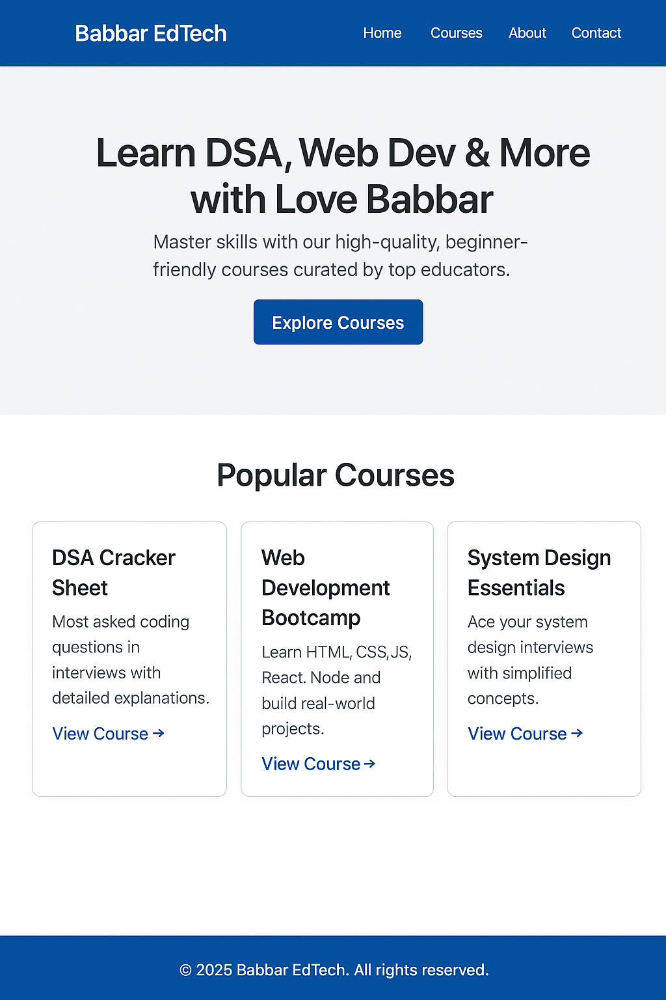

## EdTech Frontend Clone

A frontend project built using **React**, **Tailwind CSS**, and **Vite**, inspired by EdTech platforms like Babbar’s teaching interface.


## Tech Stack

-  React
-  Tailwind CSS
-  Vite
-  ESLint (for linting)


## Screenshot

 


## Installation

Clone the repo and run the app locally:

```bash
git clone https://github.com/yourusername/edtech-project.git
cd edtech-project
npm install
npm run dev
```

Open [http://localhost:5173](http://localhost:5173) in your browser.


##  Project Structure

```
edtech-project/
├── public/
├── src/
│   ├── App.jsx
│   ├── App.css
│   ├── index.css
│   ├── main.jsx
│   └── assets/
├── index.html
├── package.json
├── tailwind.config.js
├── vite.config.js
```


##  Features

- Responsive design
- Clean navbar
- Tailwind utility classes
- Component-based layout


##  Learnings

This project helped reinforce:
- Tailwind layout principles
- Vite + React integration
- Component modularity


##  Future Improvements

- Add routing (React Router)
- Create course detail pages
- Add user login interface


##  License

This project is for educational/demo purposes only.


# React + Vite

This template provides a minimal setup to get React working in Vite with HMR and some ESLint rules.

Currently, two official plugins are available:

- [@vitejs/plugin-react](https://github.com/vitejs/vite-plugin-react/blob/main/packages/plugin-react) uses [Babel](https://babeljs.io/) for Fast Refresh
- [@vitejs/plugin-react-swc](https://github.com/vitejs/vite-plugin-react/blob/main/packages/plugin-react-swc) uses [SWC](https://swc.rs/) for Fast Refresh

## Expanding the ESLint configuration

If you are developing a production application, we recommend using TypeScript with type-aware lint rules enabled. Check out the [TS template](https://github.com/vitejs/vite/tree/main/packages/create-vite/template-react-ts) for information on how to integrate TypeScript and [`typescript-eslint`](https://typescript-eslint.io) in your project.
